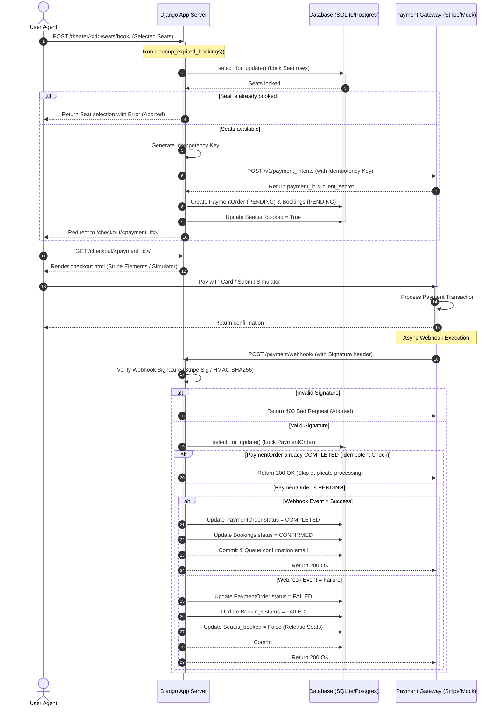

# Payment Gateway Integration Documentation

This document describes the design, implementation, and security mechanics of the BookMyShow clone payment integration (Stripe/Mock).

---

## 1. Complete Payment Lifecycle

---

## 2. Idempotency Mechanisms

Double-bookings and double-charges are common failure modes in ticket booking apps due to slow connections, double-clicking forms, or duplicate webhook payloads. We mitigate this using two distinct idempotency layers:

### A. Client-to-Server Request Idempotency
- When a user submits seat bookings, the server computes a deterministic `idempotency_key` based on the user ID, theater ID, and the sorted list of seat IDs:
  $$\text{Key} = \text{"user\_"} + \text{user\_id} + \text{"\_theater\_"} + \text{theater\_id} + \text{"\_seats\_"} + \text{sorted\_seat\_ids}$$
- Before creating a new checkout session, the database is queried for any existing active `PaymentOrder` (status `pending` or `completed`) matching this key.
- If a duplicate request is received:
  - If the transaction was already paid, the user is redirected directly to their bookings profile with a success message.
  - If the transaction is still pending, the user is redirected to the existing checkout session without creating new database rows or initiating new payments.

### B. Webhook Idempotency (Event Deduplication)
- Webhook endpoints are naturally asynchronous and can deliver duplicate messages (e.g., if a payment provider retries due to a network hiccup).
- When a webhook is received:
  1. The handler locks the `PaymentOrder` row using `select_for_update()` inside a transaction.
  2. It checks `PaymentOrder.status`:
     - If the status is `completed` or `failed`, the handler returns a `200 OK` immediately. It skips sending duplicate confirmation emails or executing redundant SQL writes.
     - This guarantees that each payment event is processed exactly once.

---

## 3. Webhook Security and Signature Verification

To prevent attackers from sending fake webhook payloads to forge ticket bookings, we enforce secure signature verification.

### A. Stripe Webhook Signature Verification
- Stripe signs the webhook body using a shared webhook signing secret (`STRIPE_WEBHOOK_SECRET`).
- The signature is passed in the `Stripe-Signature` header.
- The Django server calls `stripe.Webhook.construct_event(payload, sig_header, STRIPE_WEBHOOK_SECRET)`.
- This ensures the payload has not been modified in transit, originates from Stripe, and has not expired.

### B. Mock Webhook Signature Verification
- In local development where Stripe is disabled, signature validation is fully simulated using cryptographic HMAC signatures.
- The simulator constructs the webhook JSON payload and signs it using **HMAC SHA-256** with a local secret key `MOCK_WEBHOOK_SECRET`:
  $$\text{Signature} = \text{HMAC-SHA256}(\text{MOCK\_WEBHOOK\_SECRET}, \text{Payload})$$
- The signature is sent in the `X-Mock-Signature` header.
- The backend webhook endpoint extracts `X-Mock-Signature`, computes the expected signature over `request.body` using the same secret key, and compares them using Python's constant-time `hmac.compare_digest` to prevent timing attacks.

---

## 4. Fraud Prevention & Replay Attack Mitigation

### A. Webhook Replay Attack Mitigation
- **Timestamps / Expirations**: Payment gateways (like Stripe) embed a timestamp `t` in the signature header. The SDK verifies that this timestamp is within a tolerancy window (e.g., 5 minutes). Webhooks older than this are rejected to prevent replay attacks.
- **Cryptographic Signatures**: Since every signature is tied to the exact request body and a timestamp, an attacker cannot record a valid webhook and resend it at a later date, nor can they alter fields (like changing the amount or seat numbers) because any mutation invalidates the cryptographic signature.

### B. Fraud Prevention & Secure-Side Verification
- **Price Integrity**: Ticket pricing is determined strictly on the backend by querying the database (`Theater.ticket_price`). The frontend checkout form never submits prices or amounts. 
- **Double Lock Control**: Seat availability checking, seat locking, and status updates are performed strictly inside database transactions with row-level locks (`select_for_update()`), protecting the system against concurrent race conditions (double bookings).

---

## 5. Network Timeouts & Abandonment Handling

If a user locks seats but closes their browser, the seats must be released so other customers can book them.
- **Session Timeout (10 minutes)**: When a checkout session is created, the order status is set to `pending` with `Seat.is_booked = True`. 
- **Background Cleanup**: We implement an automatic cleanup function `cleanup_expired_bookings()` that is executed on demand whenever a user loads the home page, theater page, or selects seats.
- **Cleanup Mechanics**:
  - Finds all pending `PaymentOrder` records older than 10 minutes.
  - Updates their status to `expired`.
  - Sets corresponding bookings to `failed`.
  - Updates the associated seats to `is_booked = False`.
  - This keeps the system clean dynamically without needing complex external cron jobs.
